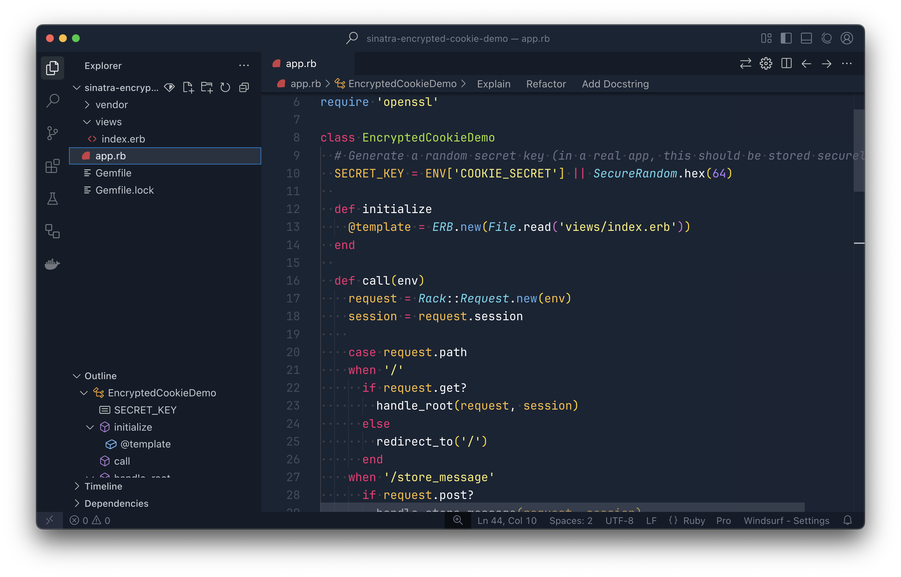

# Montexia Theme

[](https://marketplace.visualstudio.com/items?itemName=nik-holo.montexia-theme)
[](https://opensource.org/licenses/MIT)

A dark VS Code theme inspired by Monokai and One Dark Pro with a carefully selected color palette for an enhanced coding experience.

## Screenshot



*Note: Create a screenshot of your theme in action and place it in an `images` folder, then update the path above.*

## Features

- **Dark UI**: A deep, dark blue background (#192434) that's easy on the eyes during long coding sessions
- **Vibrant Syntax Highlighting**: Carefully selected colors for different syntax elements
- **Language Support**: Enhanced highlighting for JavaScript, TypeScript, Python, PHP, CSS, HTML, and more
- **Readable Comments**: Italicized comments with a distinct color to separate them from code
- **Intuitive Color Scheme**: Colors chosen to make code structure more apparent

## Installation

1. Open **Extensions** sidebar panel in VS Code. `View → Extensions`
2. Search for `Montexia Theme`
3. Click **Install** to install it
4. Click **Reload** to reload VS Code
5. From the menu bar click: Code/File > Preferences > Color Theme > **Montexia**

## Manual Installation

1. Download the [latest release](https://github.com/nik-holo/montexia-theme/releases/latest)
2. Unzip and copy the folder to the VS Code extensions folder
   - **Windows**: `%USERPROFILE%\.vscode\extensions`
   - **macOS**: `~/.vscode/extensions`
   - **Linux**: `~/.vscode/extensions`
3. Restart VS Code
4. From the menu bar click: Code/File > Preferences > Color Theme > **Montexia**

## Recommended Settings

For the best experience with Montexia Theme, consider the following VS Code settings:

```json
{
  "editor.fontFamily": "'Fira Code', Consolas, 'Courier New', monospace",
  "editor.fontLigatures": true,
  "editor.fontSize": 14,
  "editor.lineHeight": 24,
  "editor.letterSpacing": 0.5,
  "editor.cursorStyle": "line",
  "editor.cursorWidth": 2,
  "editor.cursorBlinking": "smooth"
}
```

## Contributing

If you'd like to contribute to this theme, please feel free to submit a PR on the [GitHub repository](https://github.com/nik-holo/montexia-theme).

## License

This theme is released under the [MIT License](LICENSE.txt).

## Credits

Created by [Nikita Holodenko](https://github.com/nik-holo)

Inspired by:
- [Monokai](https://monokai.pro/)
- [One Dark Pro](https://binaryify.github.io/OneDark-Pro/)

**Enjoy!**
